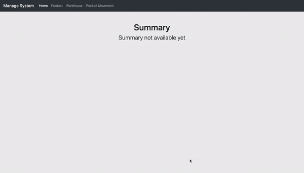
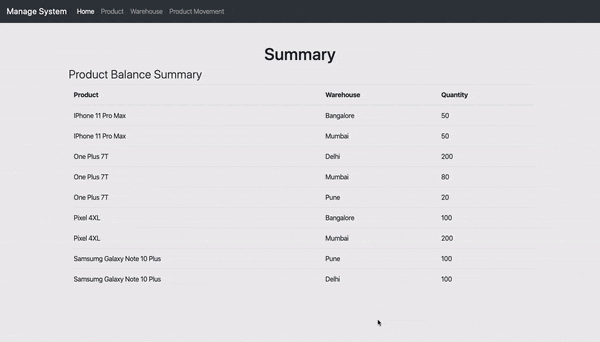
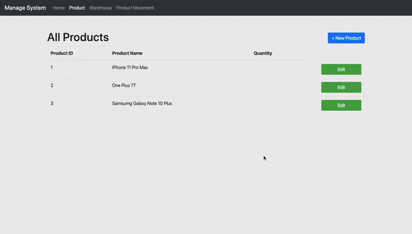
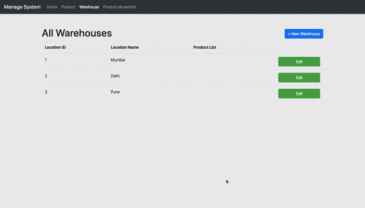
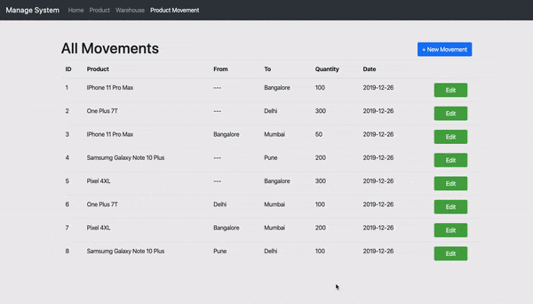
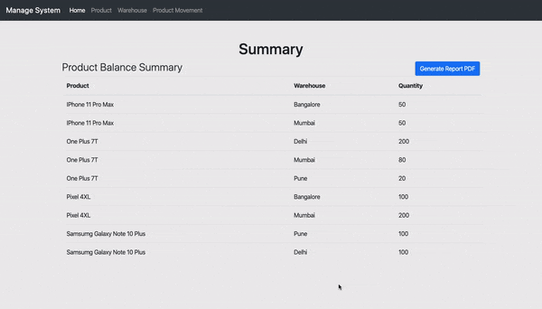

# InventoryManagementSystem
### Description
 This is inventory management system that is only focused on 'warehouses'. It can track 'products' at various 'warehouses' also the 'quantity' for each products
 
 
### Assumption
 Here it is assumed that for a location, the fist entry should have empty 'From', because you cannot send something you don't have.

### Screens

###### Empty Overview

###### Final Overview

###### Add Product

###### Add Warehouse

###### Add Product Movement

###### Generate PDF of Summary

### Dependencies
1. Flask
2. PDFKIT
3. WKHTMLTOPDF
